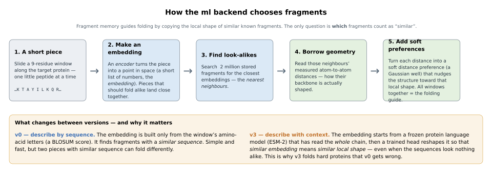
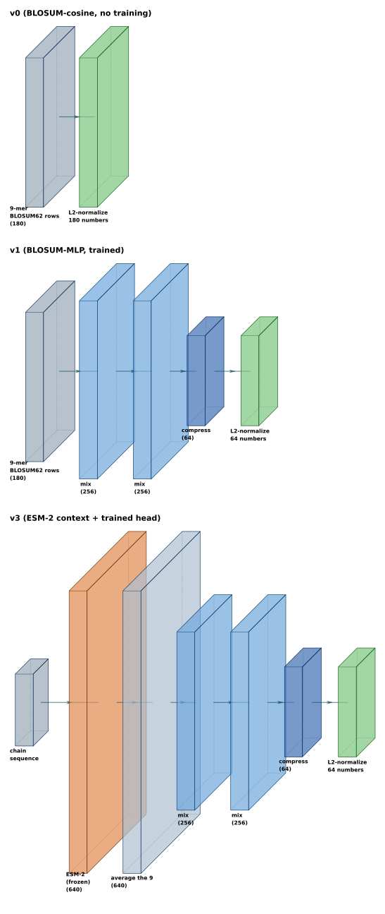

# Learned-embedding fragment retrieval (ml)

`ml` is a fragment-memory backend that selects database fragments for the AWSEM fragment-memory
potential by a *learned structural metric* instead of by sequence similarity. Each sliding window
of the target is encoded to a short vector; the most similar database fragments are retrieved by
that vector; and their stored CA/CB distances become the Gaussian wells of the potential. Encoding
by a metric trained to track local *structure* lets the memory include fragments whose sequence is
far from the target but whose backbone geometry is right — coverage that a BLOSUM sequence search
cannot reach.

Code: [`openawsem/memory/generators/ml.py`](../openawsem/memory/generators/ml.py)

> **What this method is — and is not.** The neural network does **not** predict the protein
> structure, the atomic coordinates, or the fragment-memory energy, and it is **not** trained during
> a folding simulation. It only decides **which existing database fragments** should supply the
> preferred distances used by the ordinary, unchanged AWSEM potential. Everything physical — the
> Gaussian wells, the force constant, the force field — is the conventional AWSEM machinery. The
> network changes one step: the *search* that picks the fragments.

The backend implements the standard `FragmentBackend` interface:

* `generate(sequence)` returns AWSEM `MemoryWells`, so the object is a drop-in force-field memory
  generator (`awsem generate-memory --method ml`).
* `mutation_engine(sequence, structure)` returns an `MlMutationEnergy` exposing `total_energy()`,
  `dE(position, new_aa)`, and `commit(position, new_aa)`, for Monte-Carlo sequence design.

---

## A worked example first

Before any notation, follow one window of a target protein through the whole method.

> Consider **residues 20–28** of the target — a 9-residue window. The encoder converts information
> about these nine residues into a list of **64 numbers**. These numbers do **not** represent
> distances or coordinates; they are a learned *summary* designed so that fragments that fold into
> similar local shapes receive similar summaries. The 64 numbers are rescaled to have length one.
> The database of ≈2.3 million stored fragments is then searched for the summaries pointing in
> nearly the same direction — the 20 most similar fragments. Finally, the atomic CA/CB distances
> measured in *those* 20 real fragments are dropped into the AWSEM energy as preferred distances,
> gently biasing residues 20–28 toward their local shape. Repeat for every window, and the union of
> all those preferences is the fragment-memory guide that folds the protein.

The whole dataflow, with the crucial distinction between *what is predicted from sequence* and
*what is read from real structures*:

```text
Target amino-acid sequence  (this is ALL the method sees at generation time)
    │  slide a 9-residue window along the chain
    ▼
A 9-residue window  +  its surrounding sequence context        ── predicted from sequence ──┐
    │  encoder  f_θ                                                                          │
    ▼                                                                                        │
a 64-number "retrieval embedding"  z   (a point in space, length 1)                          │
    │  nearest-neighbour search over the database embeddings                                 │
    ▼                                                                                         │
the 20 most similar database fragments                          ── read from real structures ┘
    │  read their stored CA/CB atom-to-atom distances
    ▼
Gaussian wells added to the AWSEM energy  (soft distance preferences)
```

The target's own structure is **never** used to generate its memory — only its amino-acid sequence.
Real structural information enters only through the *database* fragments that get retrieved.

### What is learned, and what is not

A common misconception is that "the neural network" does everything. In fact most of the machinery
is fixed physics and fixed algorithms; only a small head is trained.

| Component | Learned? | Changes during training? | Used during folding? |
|---|---|---|---|
| ESM-2 protein language model (v3 only) | No — pretrained elsewhere, **frozen** | No | Yes, to encode the query |
| MLP "head" (the small trained network) | **Yes** | **Yes** | Yes |
| Geometry descriptor *g* (the training target) | No — computed from real coordinates | No | **Training only**, never at folding |
| FAISS / HNSW search index | No — a data structure | No | Yes |
| Gaussian-well formula & well widths | No — fixed AWSEM physics | No | Yes |
| AWSEM force field (contacts, H-bonds, …) | No | No | Yes |

The network being trained is small: for v3 it is a 3-layer MLP head (≈0.4 M weights) sitting on top
of the frozen ESM-2 features.

---

## Background: the machine-learning vocabulary (skip if familiar)

This section defines the handful of ML terms the rest of the document uses. A full
[glossary](#glossary) is at the end.

**Embedding.** An *embedding* is a fixed-length list of numbers (a vector) produced from some input.
Three things matter:

* It is **not** generally interpretable number-by-number — no single entry "is" an angle or a
  distance.
* It is trained so that **geometric closeness of two embeddings means a desired kind of similarity**
  — here, similar local backbone shape.
* It is used for **retrieval** (finding look-alikes), not as physical coordinates. A *64-dimensional*
  embedding is simply a list of 64 numbers; it is not a 3-D structure.

**Encoder.** The function `f_θ` that turns an input into an embedding. The subscript `θ` (theta) are
its adjustable numbers, the *weights*.

**Length normalization and cosine similarity.** We compare two embeddings only by the *direction*
they point, not their magnitude:

* `‖f_θ(x)‖` is the ordinary Euclidean length of the vector (square root of the sum of squares).
* Dividing the vector by its length gives `z`, a vector of length exactly 1. This is **L2
  normalization** ("L2" = Euclidean length).
* After normalization, the dot product `z_q · z_f` of two embeddings equals the **cosine of the
  angle** between them: `+1` = same direction (very similar), `0` = perpendicular (unrelated),
  `−1` = opposite.
* Why bother: without it, the encoder could inflate "similarity" just by emitting bigger numbers.
  Forcing length 1 makes retrieval depend on the *pattern* of the embedding, not its scale.

**The neural-network blocks** (used in the encoder figure below):

* **Linear (a.k.a. dense) layer** — takes an input vector `x` and produces a new vector `y` of
  weighted sums, `y_j = b_j + Σ_i W_{ji} x_i`. The weights `W` and biases `b` are exactly what
  training adjusts. In the architecture figure this is the **"compress"** block when it *reduces* the
  number of values (e.g. 256 → 64).
* **ReLU** (rectified linear unit) — replaces every negative value by 0 and leaves positives
  unchanged. This *nonlinearity* is what lets several linear layers together represent relationships
  a single linear map cannot.
* **Batch normalization** — rescales the intermediate values during training to keep optimization
  stable; at inference it uses statistics saved from training. It does not change the meaning of the
  vector, only its numerical scale.
* **MLP** (multilayer perceptron) — a stack of `Linear → (norm) → ReLU` steps. It operates on plain
  vectors; it is **not** a graph network and does not manipulate atomic coordinates. In the figure,
  each `Linear → BatchNorm → ReLU` run is collapsed into one **"mix"** block (it mixes the input
  numbers into a new set of the same size, here 256).
* **Mean pooling** — averages several vectors into one. v3 averages the ESM-2 vectors of the nine
  residues in a window into a single window vector (the **"average"** block). Averaging by itself
  ignores order, but each ESM-2 residue vector already carries *position- and context-dependent*
  information, so window identity is not lost.

**Training vs. inference.** These are two distinct phases:

* **Training** (done once, offline): real database structures *are* available. The method measures
  structural distances between fragments, picks examples, runs them through the encoder, and adjusts
  the head's weights so structurally-similar fragments get similar embeddings.
* **Inference / generation** (every time a memory is built): only the target *sequence* is available.
  The method encodes the target's windows, retrieves database fragments, and builds ordinary
  fragment-memory wells. No structural information about the target is used.

**Frozen** means a network's weights are held fixed and **not** updated by training. v3 uses a frozen
ESM-2 as a fixed feature generator; only the small MLP head placed after it is optimized.

---

## Why a learned metric (the scientific motivation)

The AWSEM fragment-memory potential biases a structure toward the local geometry of related
fragments: for each window of the target, a set of database fragments is selected, and the pairwise
distances they carry become Gaussian wells acting on the target's atoms. The classic selection rule
is *sequence* similarity (PSI-BLAST, or the BLOSUM62 search in `local_db`). Sequence similarity is a
proxy for structural similarity, and an imperfect one: two windows with nearly identical sequence
can adopt different backbone geometry, and two windows with very different sequence can share a fold.
Where the proxy fails, the wrong fragments are selected and the wells pull the structure the wrong
way.

`ml` replaces the sequence-similarity proxy with a metric trained to track structural similarity
directly. The encoder is the only part that changes between variants, behind a fixed pipeline
(geometry descriptor → metric training → search index → wells). This gives an ablation ladder of
increasing power and cost:

* **v0** — no learning: a 9-mer is described by its concatenated BLOSUM62 rows, retrieved by cosine.
  The explicit "sequence similarity is enough" baseline.
* **v1** — a small MLP on the same BLOSUM features, trained with a metric loss.
* **v3** — a learned head on *frozen ESM-2 per-residue embeddings*, which carry full-chain context.

Only v3 beats the v0 baseline, and it does so by a clear margin (see [Results](#results)): the useful
signal is the protein-language-model *context*, not extra capacity on the bare 9-mer.

### Notation

| symbol | meaning |
|--------|---------|
| $L$ | window / fragment length, default 9 |
| $N$ | number of fragments in the database (≈2.3M for the pc30 set) |
| $x$ | a query 9-mer plus its sequence context (the encoder input) |
| $z=f_\theta(x)/\lVert f_\theta(x)\rVert$ | the L2-normalized **retrieval embedding**, $z\in\mathbb{R}^d$ |
| $d$ | embedding dimension ($180$ for v0, $64$ for the learned heads) |
| $s_f=z_q\!\cdot\!z_f$ | cosine similarity between query and database fragment $f$ |
| $\tau_\text{train}$ | temperature of the training loss (default 0.1) |
| $\tau_\text{ret}$ | temperature of the retrieval weights (default 0.07) |
| $N_\text{mem}$ | weight normalization per window (`n_mem`), default 20 |
| $k$ | number of fragments retrieved per window (`top_k`), default 20 |
| $r_{ij},\,r_{ij}^{f}$ | atom-pair distance in the target and in fragment $f$ |
| $\sigma_{ij}=\sigma_0\,\lvert i-j\rvert^{0.15}$ | Gaussian well width |
| $k_{fm}$ | fragment-memory force constant, default 0.04184 kJ/mol |
| $g_r$ | **geometry descriptor** of fragment $r$ — computed from real coordinates, training signal only |
| $d_\text{struct}$ | well-width-weighted structural distance between two fragments |

> **Two different things both called "the vector," kept distinct here.** The **retrieval embedding**
> $z$ is *predicted from sequence* and used to search. The **geometry descriptor** $g_r$ is
> *computed from a fragment's real coordinates* and used only to define the training target. The
> encoder **never sees** $g_r$ as input; $g_r$ exists only to tell training which fragments *should*
> end up close. Do not confuse the two.

## The retrieval pipeline

At inference the encoder is the entire model; everything downstream is fixed geometry and bookkeeping
shared with the other backends.



*The whole idea in five steps: slide a window along the protein, summarize it as an embedding vector,
find the database fragments with the nearest embeddings, borrow their measured atom distances, and
add them as soft distance preferences that shape the fold. The only thing that changes between
versions is how the embedding is computed — v0 from sequence, v3 from a frozen protein language model
plus a trained head.*

The database vectors $z_f$ are encoded once and stored in the index; a query protein is encoded per
window at generation time. The wells are built by the same soft-accumulation code as `local_db`
(`accumulate_soft_wells`), so the resulting energy is the standard fragment-memory potential

$$
V_\text{FM} \;=\; -\,k_{fm}\sum_{w}\sum_{(i,j)\in w}\;\sum_{f\in\text{top-}k(w)} w_f\,
\exp\!\left(-\frac{\bigl(r_{ij}-r_{ij}^{f}\bigr)^2}{2\,\sigma_{ij}^2}\right),
$$

with the per-window fragment weights set by the retrieval similarity,

$$
w_f \;=\; N_\text{mem}\,\frac{e^{\,s_f/\tau_\text{ret}}}{\sum_{g\in\text{top-}k}e^{\,s_g/\tau_\text{ret}}} .
$$

### Reading the energy

> **The Gaussian well.** Each retrieved distance $r_{ij}^{f}$ becomes one term that is *most
> favorable* (lowest energy) when the target distance $r_{ij}$ equals it, and that weakens smoothly
> as $r_{ij}$ moves away. $\sigma_{ij}$ sets the tolerance (how far you can drift before the term
> stops helping); the leading minus sign means *matching the retrieved geometry lowers the energy*.
> It is a soft *distance preference*, not a rigid restraint and not a permanent bond — calling it a
> "spring" is only loosely right, since a Gaussian is not harmonic. Several retrieved fragments
> create several preferred distances at once for the same atom pair.

> **`top_k` vs `n_mem` (both default to 20, but they are different knobs).** `top_k` = *how many*
> database fragments are retrieved per window. `n_mem` = the *total weight* those fragments share
> ($\sum_f w_f = N_\text{mem}$), i.e. the overall depth/strength of that window's wells. With
> `top_k = n_mem = 20` the *average* fragment weight is 1, but individual weights vary with
> similarity. Raising `n_mem` makes the wells stronger; raising `top_k` lets more geometries
> contribute.

> **Backoff.** Where a window has *no* confident neighbour (its best similarity $\max_f s_f$ is below
> `backoff_sim`, default 0.3), retrieval would only add noise, so the window instead falls back to a
> generic distribution: the context-free **marginal distogram** (`tensors_openawsem.npz`, the same
> tensor `fragment_db` uses). A *distogram* is a probability distribution over possible distances;
> *marginal* means it is conditioned only on coarse variables (residue identities and sequence
> separation), not on the full sequence context; it is **moment-matched** to one Gaussian per pair
> (a Gaussian with the same mean and variance replaces the full curve). The 0.3 threshold is a
> conservative heuristic, not a tuned validation-set optimum.

## Geometry descriptor and the training signal

The encoder is trained against a definition of structural similarity computed directly from the
database geometry. This **geometry descriptor** is used only during training and never at inference
(the encoder sees only sequence). The `FragmentIndex` already stores, per residue, the forward
distances to its in-window neighbours over the nine directional atom-pair channels
$\{$CA,CB,O$\}\times\{$CA,CB,O$\}$. A fragment's descriptor is the vector of all its in-window pair
distances,

$$
g_r \;=\; \bigl(\,d^{(c)}_{ab}\,\bigr)_{0\le a<b<L,\;c\in\text{channels}},
\qquad
d^{(c)}_{ab} \;=\; \texttt{dist}\bigl[r+a,\; \mathrm{sep}{=}b{-}a,\; c\bigr].
$$

> **How big is it, concretely?** For $L = 9$ there are $\binom{9}{2}=36$ residue pairs, and with 9
> directional atom-pair channels the descriptor nominally holds $36\times9 = 324$ distances.
> "Directional channel" means CA→CB and CB→CA are counted as separate entries. The energy uses only
> CA/CB pairs, but **all 9 channels feed the training descriptor**, because CA–O and O–O patterns
> sharpen the helix/strand distinction at no cost to the metric. Glycine has no CB, so its CB
> entries are absent (the index uses NaN, masked out); pairs that run past a segment edge are
> likewise NaN and masked. The pipeline only ever describes *valid* full-length windows, so within
> a window the only missing entries come from absent atoms (e.g. glycine CB).

The distance between two fragments is measured in *well-width units*, so it matches the sensitivity
of the energy — a deviation matters in proportion to how narrow that pair's well is,

$$
d_\text{struct}(r,r') \;=\; \bigl\lVert\, w\odot\bigl(g_r-g_{r'}\bigr)\,\bigr\rVert_2,
\qquad
w_{ab} \;=\; \frac{1}{\sigma_{ab}}, \quad \sigma_{ab}=\sigma_0\,(b-a)^{0.15}.
$$

> **Why weight by $1/\sigma_{ab}$.** A 1 Å disagreement matters more for a *narrow* well than for a
> *broad* one. Dividing by the well width measures every distance error in units of that pair's
> tolerance, so the training target reflects the sensitivity of the eventual energy term rather than
> raw Ångströms. Missing entries are zero-filled (they contribute no difference); the norm is **not**
> divided by the number of valid terms, so for the valid full windows used here — which differ only
> by absent glycine CB atoms — the descriptors remain comparable.

Code: [`openawsem/memory/ml/fingerprint.py`](../openawsem/memory/ml/fingerprint.py).

## The encoders

All encoders map a 9-mer (with context, for v3) to a unit vector and differ only in $f_\theta$. v0 is
parameter-free; v1 and v3 are trained (see [Metric learning](#metric-learning)). The learned head is
a small batch-normalized MLP, `Linear→BN→ReLU→Linear→BN→ReLU→Linear`, hidden width 256, output
$d=64$.



*The three encoders, each a chain of boxes carrying a vector of numbers from the input (grey) to the
length-1 output (green). Box size scales with √(vector length) — a length-D vector drawn as roughly a
√D × √D square — so a bigger box literally means more numbers.*

**Reading the architecture figure.** The plain-language box labels map to the operations defined
[above](#background-the-machine-learning-vocabulary-skip-if-familiar):

| figure label | operation | what it does |
|---|---|---|
| **input** | — | the raw numbers fed in (BLOSUM rows for v0/v1; a chain sequence for v3) |
| **ESM-2 (frozen)** | pretrained language model | turns each residue into 640 context-aware numbers; weights fixed |
| **average** | mean pooling | averages the window's 9 residue vectors into one |
| **mix** | `Linear → BatchNorm → ReLU` | re-mixes the numbers into a new set of 256 (learned) |
| **compress** | `Linear` (no activation) | projects down to the final 64 numbers (learned) |
| **L2-normalize** | divide by length | rescales to length 1 so only direction matters |

In symbols, with $B$ the BLOSUM62 matrix and $h_i$ the frozen ESM-2 embedding of residue $i$ *in its
full-chain context*,

$$
\text{v0:}\;\; f_\theta(x)=\bigl[\,B[x_1,:]\,\Vert\cdots\Vert\,B[x_L,:]\,\bigr],
\qquad
\text{v1:}\;\; f_\theta(x)=\mathrm{MLP}_\theta\!\bigl(\bigl[\,B[x_1,:]\,\Vert\cdots\Vert\,B[x_L,:]\,\bigr]\bigr),
$$

$$
\text{v3:}\;\; f_\theta(x)=\mathrm{MLP}_\theta\!\left(\frac{1}{L}\sum_{a=0}^{L-1} h_{\,s+a}\right),
\qquad
z=\frac{f_\theta(x)}{\lVert f_\theta(x)\rVert_2}.
$$

The key property of v3: each $h_i$ already encodes the whole chain (ESM-2 attends over the full
sequence), so even a window's local embedding carries long-range context that a bare 9-mer cannot.

> **What "frozen ESM-2" does, precisely.** ESM-2 is a protein language model pretrained on millions
> of sequences; *frozen* means its weights are never changed here — it is a fixed feature generator,
> and only the small MLP head after it is trained. ESM-2 sees the entire amino-acid sequence and so
> produces a representation of each residue that depends on its neighbours, but it does **not** see
> the target's experimentally determined structure. ESM-2 by itself is *not* "matching on shape": it
> supplies contextual sequence features, and the **trained head** is what reshapes those features so
> that embedding similarity corresponds to structural similarity.

The ESM-2 features are precomputed once over the database into a memmap aligned to the
`FragmentIndex` rows ([`ml/esm_features.py`](../openawsem/memory/ml/esm_features.py)); database
encoding then only mean-pools and runs the head, while a query protein is run through ESM-2 once at
generation time. Code: [`ml/encoder.py`](../openawsem/memory/ml/encoder.py),
[`ml/encoder_torch.py`](../openawsem/memory/ml/encoder_torch.py),
[`ml/esm_encoder.py`](../openawsem/memory/ml/esm_encoder.py).

The figure is generated automatically from the PyTorch modules — forward-hook introspection → a
semantic block spec → [neural-netz](https://typst.app/universe/package/neural-netz/) Typst → SVG — by
[`docs/figures/make_arch_figs.py`](figures/make_arch_figs.py); the intermediate spec is in
[`docs/figures/encoders.json`](figures/encoders.json).

## Metric learning

v1 and v3 are trained so that cosine *closeness* in embedding space tracks *structural* closeness
$d_\text{struct}$. Training is **contrastive**: it does not regress a number, it just teaches the
encoder to rank a "should-be-close" example above "should-be-far" ones.

> **The vocabulary of contrastive learning.**
> * **Anchor** — the fragment currently used as the reference point.
> * **Positive** — a fragment that *should* be close to the anchor in embedding space, because its
>   geometry is similar.
> * **Negative** — a fragment that should *not* be close, because its geometry differs.
> * **Hard negative** — an especially confusing negative: similar *sequence* but different
>   *structure* — exactly the case sequence search gets wrong.
> * **In-batch negative** — another anchor's positive, reused for free as a negative for this anchor.

The whole value of learning lives in how these pairs are **mined**, because that is where a learned
metric can beat sequence similarity:

```text
   anchor a  ─► f_θ ─► z_a
   positive  =  the single structural nearest neighbour (small d_struct) on a DIFFERENT chain,
                kept only if it is genuinely close (below a d_struct quantile)
                 → structurally close but sequence-far : what BLOSUM would MISS
   hard neg  =  among ~50 BLOSUM-similar fragments, the structurally-farthest one that is
                at least 1.5x the positive's d_struct away
                 → sequence-similar but structurally wrong : what BLOSUM gets WRONG
                 (in-batch negatives from the other positives are added for free)
```

The positive is required to be **on a different chain** so it is a genuinely independent example of
the same local shape — not a trivial copy of the anchor (an overlapping window of the same protein
would be nearly identical in both sequence and structure and would teach nothing). Positives are
found with a FAISS search over the geometry descriptors $g$; hard negatives with the existing BLOSUM
k-mer search, filtered by $d_\text{struct}$. The chains are split by `chain_code % 7`, with the
held-out seventh never seen in training, so evaluation is on unseen chains. Code:
[`ml/train.py`](../openawsem/memory/ml/train.py).

The loss is InfoNCE (NT-Xent):

$$
\mathcal{L} \;=\; -\,\log\frac{\exp\!\bigl(z_a\!\cdot\!z_p/\tau_\text{train}\bigr)}
{\exp\!\bigl(z_a\!\cdot\!z_p/\tau_\text{train}\bigr)+\sum_{n}\exp\!\bigl(z_a\!\cdot\!z_n/\tau_\text{train}\bigr)} .
$$

> **What the loss does, in words.** For each anchor it compares the anchor's similarity to *its*
> positive against the anchor's similarity to all the negatives. The loss is small exactly when the
> positive is the most similar of the bunch. Training nudges the head's weights, over and over, to
> make that happen. Note that $d_\text{struct}$ does **not** appear in the equation: structural
> distance is used to *choose* which fragment is the positive and which are negatives, not as a
> numerical target. **Temperature** $\tau_\text{train}$ controls how sharply the loss focuses on the
> closest candidates — smaller temperature makes small similarity gaps produce large changes. This is
> a *different* parameter from the retrieval temperature $\tau_\text{ret}$ that weights neighbours at
> generation time (0.1 vs 0.07); the document keeps them as separate symbols.

**Why v1 fails — concretely.** v1's encoder input is the *isolated* 9-mer (its BLOSUM rows). It is a
deterministic function of those nine letters, so **if two fragments have the same 9-residue sequence,
v1 must give them exactly the same embedding** — even when they fold differently in different
proteins. No amount of training capacity removes that degeneracy. v3's input includes full-chain
context, so two identical 9-mers in different proteins get *different* ESM-2 representations and can
be told apart. That is the entire reason v3 works and v1 does not — not "the 9-mer is too small a
network," but "the 9-mer alone does not determine the structure."

## Mutation energy for Monte-Carlo

`MlMutationEnergy` ([`mutation.py`](../openawsem/memory/mutation.py)) evaluates the change in
fragment-memory energy under a point mutation **on a fixed structure**.

> **What `dE` means.** The 3-D structure is held fixed; only the *sequence-derived memory* changes.
> So `dE` is the change in the **fragment-memory term only**, not total protein stability. A negative
> $\Delta V$ means the mutation makes the fixed structure more compatible with the fragments its new
> sequence retrieves. `dE(p, a)` is a *trial* — it does not change the engine's stored sequence;
> `commit(p, a)` accepts the mutation and updates the stored state.

A mutation at position $p$ alters only the (at most $L$) windows covering $p$; for each, the engine
re-encodes the mutated 9-mer, re-retrieves its neighbours, rebuilds the wells, and differences the
window energy,

$$
\Delta V \;=\; \sum_{w\ \text{covering}\ p}\Bigl(E_w[\text{mutant}] - E_w[\text{WT}]\Bigr),
\qquad
E_w \;=\; -\,k_{fm}\!\!\sum_{(i,j)\in w}\sum_{f} w_f\,
\exp\!\left(-\frac{(r_{ij}-r_{ij}^{f})^2}{2\sigma_{ij}^2}\right).
$$

Unlike the BLOSUM-additive engines (`mc_fragments`, `fulldb`), the learned similarity is *not*
additive over sequence positions, so there is no closed-form reweighting: the covering windows must
be re-embedded and re-searched.

> **This "only the covering windows change" shortcut is exact for v0/v1, but not for v3.** v0/v1
> encode each window from its own letters, so a point mutation can only affect the $L$ windows that
> contain it. v3 encodes a window from the *whole-chain* ESM-2 pass, where attention is global, so a
> single mutation shifts the embeddings of *every* window. A correct v3 mutation step would therefore
> require a fresh ESM-2 forward pass over the whole chain and a re-encode of *all* windows — far too
> slow for high-throughput Monte-Carlo. For that reason the MC engine uses the cheap **v0** encoder;
> v3 is a generation-time coverage tool, not a per-move design metric.

With the HNSW index the v0 engine reaches roughly 234 Monte-Carlo trials per second end-to-end on
1r69 (against about 2–3/s with an exact flat index), and `dE` agrees with a full mutant-memory
recompute to about $10^{-5}$.

### The search index (FAISS / flat / HNSW)

> **Exact vs. approximate nearest-neighbour search.** For each query embedding, *exact* retrieval
> would compute the similarity to all ≈2.3 million database embeddings and sort them — correct but
> slow. **Approximate nearest-neighbour (ANN)** search avoids the exhaustive scan: **HNSW**
> (Hierarchical Navigable Small World) organizes the vectors into a navigable graph and walks toward
> the most promising neighbours, occasionally missing a true top candidate in exchange for a large
> speed-up. **Recall** is the fraction of the exact top-$k$ that the approximate search recovers.
> **FAISS** is the library that implements both index types; an **index** here just means the data
> structure used to search the vectors.

`EmbeddingIndex` ([`retrieval/embedding.py`](../openawsem/memory/retrieval/embedding.py)) stores the
database vectors $z_f$ and answers top-$k$ cosine queries with two backends:

| backend | recall | per query | use |
|---------|--------|-----------|-----|
| flat (`IndexFlatIP`, exact) | 1.000 | ~40 ms | the ΔE oracle; small databases |
| HNSW (`IndexHNSWFlat`, graph) | 0.999 (mean top-20 overlap) | ~0.09 ms | generation and Monte-Carlo |

Here recall 0.999 is the *average fraction of the exact 20 neighbours* the HNSW query returns (not
the probability of getting all 20). The HNSW graph (`M = 32`) takes a few minutes to build, so it is
persisted with `faiss.write_index` and reloaded; the flat index rebuilds instantly from the stored
vectors. A numpy matmul fallback covers the case where FAISS is absent (v0 then works without any
extra dependency).

> **Timing caveat.** The per-query times above are single-query, index-already-loaded, on the
> development machine (one RTX 3080 Ti host, FAISS-CPU search over $d=64$ vectors); they exclude index
> load and, for v3, the one-time ESM-2 forward pass. The Monte-Carlo rate (234 trials/s) is the
> end-to-end v0 figure including well rebuilding. Treat all of these as order-of-magnitude, not
> portable benchmarks.

## Results

All on the pc30 database (≈2.3M fragments at 30 % sequence-identity cull).

> **The metrics, defined.**
> * **Hard-negative AUC** (the *gate*) — among BLOSUM-similar fragment pairs on **unseen chains**,
>   how often does the embedding give a *higher* similarity to the structurally-close pair than to a
>   structurally-far "hard negative" pair? 0.5 = random ordering, 1.0 = perfect. This is the decisive
>   test of whether the metric learned anything sequence search doesn't already give.
> * **Spearman** — rank correlation between embedding distance ($1-z_a\!\cdot\!z_b$) and the true
>   $d_\text{struct}$ over held-out pairs. It tests *ordering* (do embedding-closer pairs tend to be
>   structurally closer?), not exact numerical agreement.
> * **Neighbour native-distance RMSE** — for a query window, take its 20 retrieved fragments, form the
>   weight-averaged retrieved CA/CB distance per in-window pair, and compare to the *target's own
>   native* distances; RMSE over those pairs, in nm. Lower = the retrieved fragments are
>   geometrically closer to the truth.

| encoder | input | hard-negative AUC | Spearman($d_\text{emb},d_\text{struct}$) |
|---------|-------|:-----------------:|:----------------------------------------:|
| v0 BLOSUM-cosine | 9-mer | 0.572 | 0.150 |
| v1 BLOSUM-MLP | 9-mer | 0.565 | — |
| **v3 ESM-2 150M** | 9-mer in chain context | **0.748** | **0.477** |
| **v3 ESM-2 650M** | 9-mer in chain context | **0.801** | **0.578** |

The gate improves from the 150 M to the 650 M ESM-2 model (the only two sizes tested). The v3 result
is supported by **four control analyses**: it is robust across 7 random seeds (margin ≈ 0.17 over
v0); it needs *both* the ESM context *and* the trained head (a v1-style control trained the same way
on BLOSUM features scores 0.542, below v0; raw mean-pooled ESM with *no* head scores only 0.585); and
it reflects real geometry, not just an ordering — v3 retrieves geometrically closer fragments
(weighted neighbour native-distance RMSE 0.271 nm vs v0 0.370 nm).

> **Scope of the "no leakage" claim.** The head trains on a disjoint set of chains, and the structural
> labels are database coordinates ESM never sees — so there is no *direct chain overlap and no direct
> label leakage*. But the split is **chain-level, not homology-level**: homologous proteins may fall
> on both sides of the split, and ESM-2 was pretrained on a broad sequence corpus that may include
> related sequences. The gate is best read as "generalizes to unseen *chains*," not "to unseen
> *folds*."

### Folding

The ultimate test is whether better retrieval folds proteins better. On a panel of **8 proteins, none
present as an exact database chain**, each folded from extended (2 replicates, 8×10⁶ steps) with the
**conventional** PSI-BLAST fragment memory (homologs excluded, `brain_damage=1`), the **v0** memory,
and the **v3** memory — *same force field, only the fragment-memory generation differs* — the tail
fold quality $Q$ is:

> **What $Q$ and "tail $Q$" mean.** $Q$ is the fraction of native contacts present, ranging from ≈0
> (unrelated to native) to 1 (native-like). "Tail $Q$" here is the **mean $Q$ over the last 10 % of
> the trajectory** (the cooled-down basin), averaged over the 2 replicates. Two replicates is too few
> to resolve differences of ≈0.01 from run-to-run variance — read those as ties.

| target | class | conventional | v0 | v3 |
|--------|-------|:---:|:---:|:---:|
| 1enh | α | 0.53 | 0.30 | **0.67** |
| 2gb1 | β | 0.38 | 0.40 | **0.72** |
| 2cro | α | 0.33 | 0.32 | **0.49** |
| 1r69 | α | **0.53** | 0.42 | 0.50 |
| 1ctf | α/β | 0.33 | 0.33 | **0.40** |
| 1ubq | α/β | 0.27 | **0.63** | **0.63** |
| 1shg | β | 0.32 | **0.60** | 0.59 |
| 1csp | β | 0.29 | **0.29** | 0.28 |
| **mean** | | **0.372** | **0.412** | **0.534** |

On this *homolog-excluded* panel, **v3 has the best mean $Q$ (0.534) and the best or tied-best $Q$ on
6 of 8 targets**; v0 (0.412) already edges the conventional PSI-BLAST memory (0.372). The large v3
wins are targets where both v0 *and* conventional fail to fold ($Q\approx0.3$–$0.4$) and v3 reaches
near-native (1enh, 2gb1, 2cro). Conventional wins outright only on 1r69 — exactly the saturated
single-target case used in earlier tests, which is why that comparison was inconclusive and the
multi-target panel was needed. The caveat cuts both ways: excluding homologs (`brain_damage=1`) is the
fair *de novo* setting but strips conventional of its best templates (e.g. 1ubq collapses to 0.27),
which is precisely the coverage gap a structural metric is meant to fill. A cheap CPU retrieval screen
(the neighbour-distance RMSE above) predicts the fold direction and can pre-select targets before
paying for folding.

### Summary

* **v0** ships as the dependency-light default; its wells are numerically ≈ `local_db` (per-pair
  energy correlation 0.94–0.99) and it beats the context-free marginal.
* **v1** (a learned metric on the bare 9-mer) buys nothing — under the tested architecture, mining,
  and hyperparameters it does not beat v0, for the structural reason given above (an isolated 9-mer
  cannot distinguish same-sequence/different-structure fragments).
* **v3** (a head on frozen ESM-2 context) is the real result: it wins the gate by a wide,
  size-scaling margin, retrieves geometrically better fragments, and has the best mean fold $Q$
  (0.534) on the homolog-excluded panel — ahead of v0 (0.412) and the conventional PSI-BLAST memory
  (0.372) — without regressing any target relative to v0.
* The learned metric also powers a working Monte-Carlo `dE` engine (~234 trials/s via HNSW, v0
  encoder), separate from the BLOSUM-additive `mc_fragments`/`fulldb` engines.

## v4 — generative distogram: predict the wells, don't retrieve them

v0/v3 all *retrieve* real fragments and copy their distances. **v4 is a fork**: it *predicts* the
wells directly from ESM-2 context, with **no database lookup at inference**. For each in-window CA/CB
pair it outputs a $K$-component Gaussian mixture over the pair distance; each component becomes a well
($\text{weight}_k = N_\text{mem}\,\pi_k$, $r_\text{mean}=\mu_k$, $\sigma_k$). Because the energy
already sums all wells sharing a $(\text{resid}_i,\text{name}_i,\text{resid}_j,\text{name}_j)$ group,
the output is an ordinary `MemoryWells` and the force field is unchanged. v4 is the
context-conditioned, $K$-component generalization of the retrieval backend's marginal *backoff* (which
emits one Gaussian per pair from a context-free table). Backend: `--method ml_gen`, code
[`generators/ml.py::MlGen`](../openawsem/memory/generators/ml.py) +
[`ml/distogram.py`](../openawsem/memory/ml/distogram.py).

**Head.** A shared per-pair MLP over $[\,h_a \Vert h_b \Vert \mathrm{emb}(\text{sep})\,]$ — the two
residues' frozen ESM-2 vectors plus a learned separation embedding — with four independent CA/CB
channel heads. Trained by **maximum likelihood** of each database fragment's *own* observed distance
(the geometry descriptor of [§ Geometry descriptor](#geometry-descriptor-and-the-training-signal)),
weighted by $1/\sigma$ as before. One ESM-2 pass per chain at generation time; the database is used
only to *train* the head, never to generate.

$$
p(d \mid x) \;=\; \sum_{k=1}^{K}\pi_k(x)\,\mathcal{N}\!\bigl(d \mid \mu_k(x),\,\sigma_k\bigr),
\qquad x = \text{ESM-2 context of the pair's two residues}.
$$

**$\sigma$ is fixed to the AWSEM law** $\sigma=\sigma_0\,\text{sep}^{0.15}$ by default. We tried
*predicting* $\sigma$ (free-σ): it lowered in-distribution held-out NLL but **worsened**
out-of-distribution panel reconstruction (e.g. 1ctf NLL 8.3 → 14.3), because a learned-sharp $\sigma$
becomes *confidently wrong* on unseen folds. The fixed law is a useful **regularizer** against that
overconfidence, at no cost in geometry (RMSE 0.282 vs 0.280 nm) — so v4 ships fixed-σ.

**Results.** v4 clears the gates: held-out distance NLL beats the context-free marginal (Δ +0.76),
and on the 8-panel native structures its mean E[d]-to-native **RMSE (0.282 nm) matches retrieval v3
(0.289)** — a database-free predictor reconstructs local geometry as well as 20-fragment retrieval.
Folding (same harness, 2 reps):

| target | class | **v4 (generative)** | v3 (retrieval) | v0 | conventional |
|--------|-------|:---:|:---:|:---:|:---:|
| 1r69 | α | **0.64** | 0.50 | 0.42 | 0.53 |
| 2cro | α | **0.57** | 0.49 | 0.32 | 0.33 |
| 1enh | α | 0.58 | **0.67** | 0.30 | 0.53 |
| 1ctf | α/β | **0.43** | 0.40 | 0.33 | 0.33 |
| 2gb1 | β | 0.44 | **0.72** | 0.40 | 0.38 |
| 1csp | β | **0.39** | 0.28 | 0.29 | 0.29 |
| 1ubq | α/β | 0.36 | **0.63** | 0.63 | 0.27 |
| 1shg | β | 0.36 | **0.59** | 0.60 | 0.32 |
| **mean** | | **0.471** | **0.535** | 0.411 | 0.372 |

v4 folds **above v0 and the conventional PSI-BLAST pipeline, below retrieval v3**, and **wins outright
on 4/8** targets (best-ever 1r69 at 0.64). The pattern is interpretable: v4 wins on **α /
locally-determined** folds and loses on **β-sheet** targets (2gb1, 1ubq, 1shg), where non-local strand
register favors retrieving *real* β-fragments over predicting local geometry. A caveat on the cheap
recon screen: **1ubq had v4's *best* reconstruction RMSE yet its *worst* fold** — local geometry
quality predicts the α wins but not the β-sheet failures.

> **Bottom line.** v4 does not replace v3 in general, but it is a genuine result: a single-forward-pass
> memory with **no fragment database at inference** beats the conventional pipeline and folds α
> proteins better than retrieval. Natural next steps: a hybrid (v4 where retrieval coverage is thin,
> v3 otherwise), and non-local context for β register. v4 uses the **cheap CPU recon screen** the same
> way v3 does — but only as an α-target predictor.

## Usage

```bash
conda activate openawsem_torch          # openawsem + torch (CUDA) + faiss + fair-esm

# v0 — no training, works anywhere:
python -m openawsem.memory.cli --method ml --encoder v0 \
    --database ~/Databases/fragment_db/output_pc30 \
    --sequence target.fasta --n-mem 20 --out frags_ml_v0.json

# v3 — precompute ESM-2 features once, train the head, then generate:
python -m openawsem.memory.ml.esm_features <db> --model t30_150M --out <esm_dir>
python -m openawsem.memory.ml.train <db> --encoder v3 --esm-dir <esm_dir> \
    --esm-model t30_150M --out enc_v3.pt
```

```python
# v4 (ml_gen) — generative distogram: predict the wells from ESM-2 context, NO database at inference:
from openawsem.memory.generators.ml import MlGen
gen = MlGen("enc_v4.pt")                  # a saved DistogramModel head (query-only)
mem = gen.generate(sequence)              # one ESM-2 pass per chain -> MemoryWells
mem.save("frags_ml_v4.json")
```

```python
from openawsem.memory.generators.ml import Ml

# Monte-Carlo sequence design with the learned ΔE (HNSW index for speed):
gen = Ml("~/Databases/fragment_db/output_pc30", encoder="v0", index_type="hnsw")
eng = gen.mutation_engine(sequence, structure)
eng.total_energy()         # current fragment-memory energy
eng.dE(position, "A")      # energy change of a trial mutation (no state change)
eng.commit(position, "A")  # accept the mutation
```

Key constructor parameters of `Ml`:

| parameter | default | role |
|-----------|---------|------|
| `database` | | `fragdb` output directory with a built `fragment_index/` |
| `encoder` | `"v0"` | `"v0"`, or an `Esm2Encoder`/path for a learned encoder |
| `embedding_index` | `None` | directory of a prebuilt `EmbeddingIndex` (else built in memory) |
| `index_type` | `"flat"` | `"flat"` (exact) or `"hnsw"` (fast, for generation / Monte-Carlo) |
| `top_k` | 20 | fragments retrieved per window |
| `temp` | 0.07 | retrieval-weight temperature $\tau_\text{ret}$ |
| `n_mem` | 20 | weight normalization $N_\text{mem}$ |
| `min_seq_sep`, `max_seq_sep` | 3, 9 | pair separation range (effective cap $L-1$) |
| `well_width` | 0.1 | $\sigma_0$ in $\sigma_{ij}=\sigma_0\lvert i-j\rvert^{0.15}$ (nm) |
| `backoff`, `backoff_sim` | `True`, 0.3 | fall back to the marginal distogram for low-similarity windows |
| `k_fm` | 0.04184 | fragment-memory force constant (kJ/mol) |

## Glossary

For readers without a machine-learning background, in rough order of appearance.

| term | meaning |
|---|---|
| **model** | a function with adjustable numbers (weights) fit to data |
| **parameter / weight** | one adjustable number inside a model |
| **training** | adjusting the weights so the model behaves as desired on examples |
| **inference / generation** | using a trained model on new input (here: building a memory) |
| **feature** | a precomputed numeric description of an input (e.g. ESM-2 outputs) |
| **embedding** | a fixed-length vector summarizing an input, compared by geometric closeness |
| **dimension** | the number of entries in a vector (e.g. a 64-D embedding = 64 numbers) |
| **encoder** | the function that produces an embedding |
| **pretrained** | trained earlier on a separate, larger task (ESM-2) |
| **frozen** | weights held fixed, not updated by the current training |
| **dense / linear layer** | a weighted-sum transform $y_j=b_j+\sum_i W_{ji}x_i$ |
| **activation (ReLU)** | a nonlinearity; ReLU sets negatives to 0 |
| **batch normalization** | rescales intermediate values to stabilize training |
| **MLP** | a stack of linear layers + activations operating on vectors |
| **pooling (mean)** | combining several vectors into one by averaging |
| **L2 normalization** | dividing a vector by its Euclidean length to make it length 1 |
| **cosine similarity** | dot product of two length-1 vectors = cosine of their angle |
| **metric learning** | training embeddings so distance encodes a chosen similarity |
| **contrastive learning** | training by ranking a positive above negatives |
| **anchor / positive / negative** | reference / should-be-close / should-be-far example |
| **hard negative** | a deceptive negative (similar sequence, different structure) |
| **loss function** | the number training minimizes (here InfoNCE) |
| **temperature** | a scale that sharpens or softens a softmax (two here: train, retrieval) |
| **nearest neighbour** | the most similar stored item to a query |
| **approximate nearest neighbour (ANN)** | fast, slightly inexact neighbour search (HNSW) |
| **index** | a data structure for searching vectors (FAISS flat or HNSW) |
| **recall** | fraction of the true top-$k$ that an approximate search recovers |
| **AUC** | probability a classifier ranks a true positive above a true negative (0.5 = chance) |
| **train/validation/test split** | disjoint data subsets; here a chain-level split |
| **data leakage** | test information seeping into training, inflating results |
| **ablation** | removing a component to measure its contribution (the v0→v1→v3 ladder) |
| **baseline** | the simplest method a new method must beat (v0) |
| **out-of-distribution** | inputs unlike the training data; here: chains, not folds |
