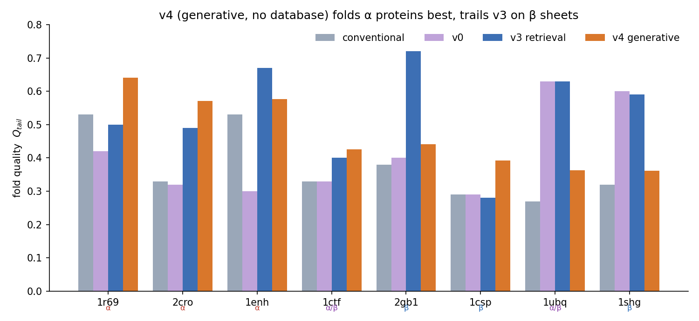
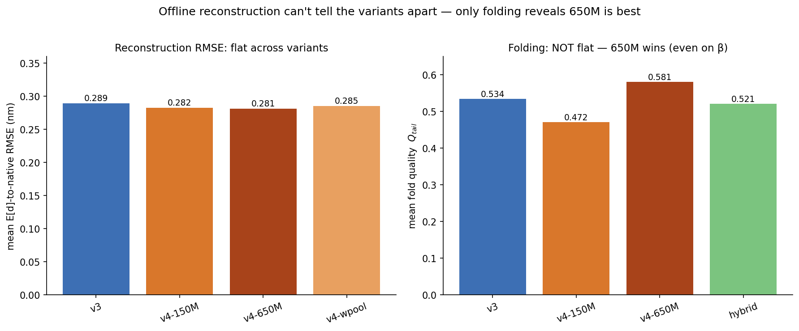
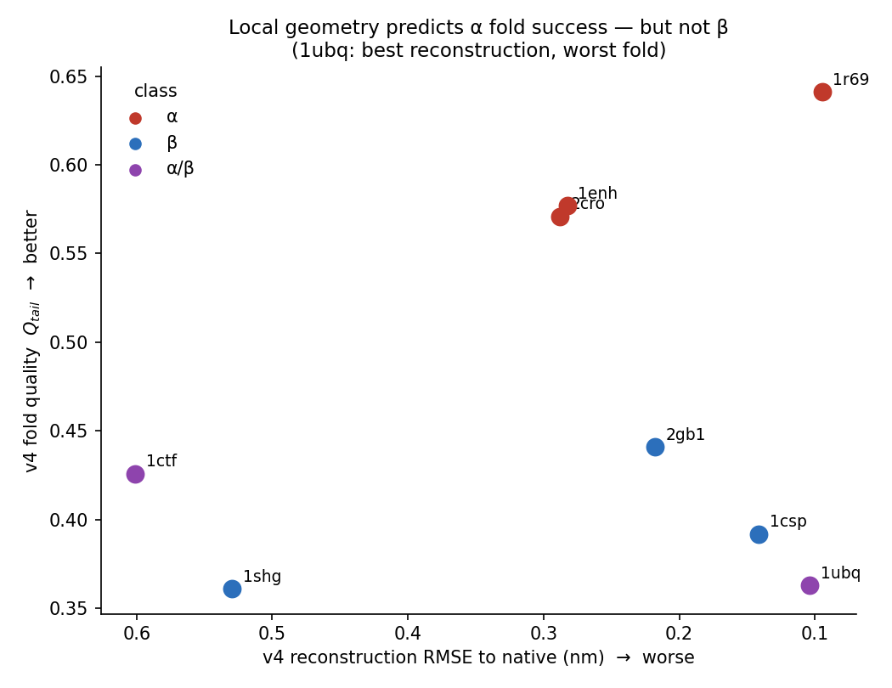
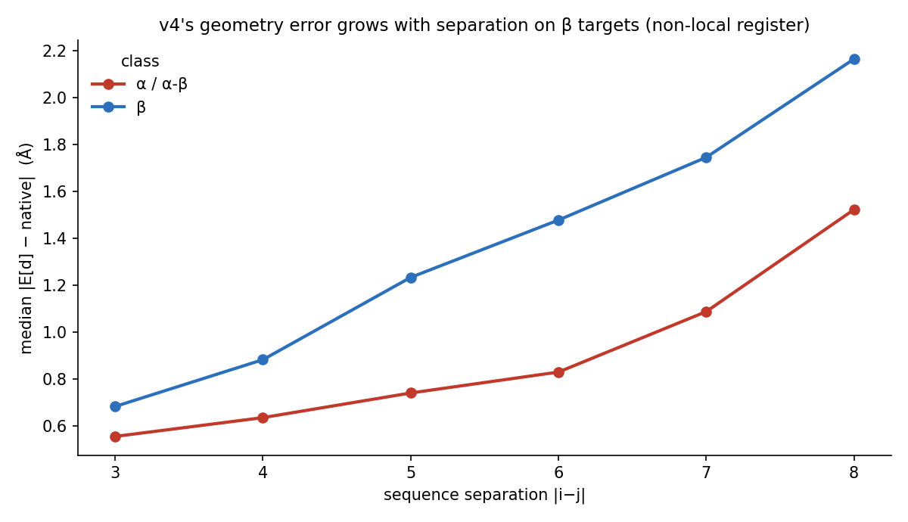
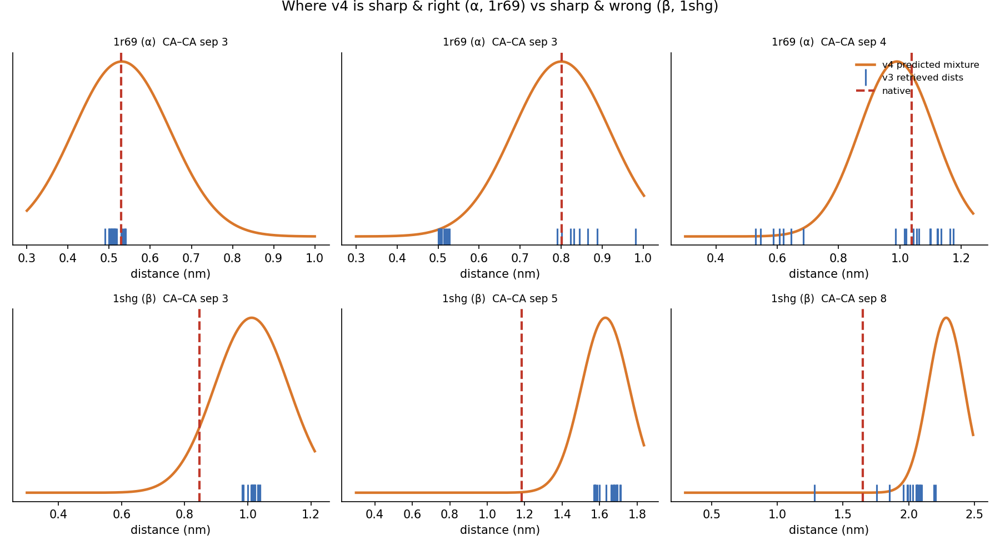
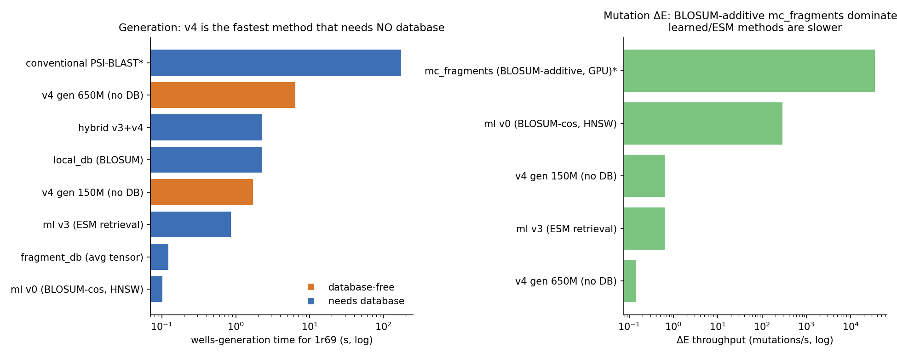

# Learned fragment-memory backends (`ml` retrieval, `ml_gen` generation)

These backends build the AWSEM fragment-memory potential with a *learned model of local protein
structure* instead of a sequence search. They come in one **family of versions** that all feed the
same, unchanged AWSEM force field — they only change how the per-window Gaussian wells are chosen:

* **v0 / v1 / v3 — retrieval** (`--method ml`): encode each window to a short vector, find the most
  similar database fragments, and copy *their* measured CA/CB distances into the wells.
* **v4 — generation** (`--method ml_gen`): *predict* the wells directly from sequence context, with
  **no database lookup at inference** at all.

The headline: the strongest member is **v4 on the 650M ESM-2 model — it folds proteins better than
every other method tested, including PSI-BLAST and retrieval, while needing no fragment database**
(see [Results](#results)).

Code: [`openawsem/memory/generators/ml.py`](../openawsem/memory/generators/ml.py).

> **What these methods are — and are not.** The neural network does **not** predict the protein
> structure, the atomic coordinates, or the fragment-memory energy, and it is **not** trained during
> a folding simulation. It only chooses **the preferred distances** that go into the ordinary,
> unchanged AWSEM potential — either by picking which database fragments supply them (retrieval) or
> by predicting them (generation). Everything physical — the Gaussian wells, the force constant, the
> force field — is the conventional AWSEM machinery.

Both backends implement the standard `FragmentBackend` interface:

* `generate(sequence)` returns AWSEM `MemoryWells`, a drop-in force-field memory
  (`awsem generate-memory --method ml` / `--method ml_gen`).
* the retrieval backend also offers `mutation_engine(sequence, structure)` → an `MlMutationEnergy`
  exposing `total_energy()`, `dE(position, new_aa)`, `commit(position, new_aa)` for Monte-Carlo design.

---

## A worked example first

Before any notation, follow one window of a target protein through the method — first the
**retrieval** way (v0/v1/v3), then the **generative** way (v4).

> **Retrieval (v0/v1/v3).** Consider **residues 20–28** of the target — a 9-residue window. The
> encoder converts information about these nine residues into a list of **64 numbers**. These numbers
> do **not** represent distances or coordinates; they are a learned *summary* designed so that
> fragments that fold into similar local shapes receive similar summaries. The 64 numbers are
> rescaled to length one. The database of ≈2.3 million stored fragments is searched for the summaries
> pointing in nearly the same direction — the 20 most similar fragments. Finally, the atomic CA/CB
> distances measured in *those* 20 real fragments are dropped into the AWSEM energy as preferred
> distances, gently biasing residues 20–28 toward their local shape.

> **Generation (v4).** Same window, but no search. A trained network reads the window *in the context
> of the whole chain* and **predicts, for each pair of residues in the window, a few likely
> distances** (a small "menu" of Gaussian wells). Those predicted distances go straight into the
> AWSEM energy. No database is consulted at all — the network has *learned* what local geometries the
> sequence implies.

Either way, repeat for every window and the union of all those preferences is the fragment-memory
guide that folds the protein. The two dataflows, side by side:

```text
                 RETRIEVAL  (v0/v1/v3, --method ml)        GENERATION  (v4, --method ml_gen)

 target sequence ─► slide a 9-residue window           target sequence ─► slide a 9-residue window
     │  encoder f_θ                                         │  ESM-2 context + trained head
     ▼                                                      ▼
 a 64-number embedding z                                per-pair distance prediction
     │  nearest-neighbour search over ~2.3M db vectors      │  (no database)
     ▼                                                      ▼
 the 20 most similar database fragments                 a K-Gaussian mixture per CA/CB pair
     │  copy their measured CA/CB distances                 │  use the predicted means/weights
     ▼                                                      ▼
 Gaussian wells in the AWSEM energy                     Gaussian wells in the AWSEM energy
```

The target's own structure is **never** used to build its memory — only its amino-acid sequence. In
retrieval, real structural information enters through the *database* fragments; in generation, it was
distilled into the network's weights during training and never touched again at inference.

### What is learned, and what is not

A common misconception is that "the neural network" does everything. In fact most of the machinery
is fixed physics and fixed algorithms; only a small head is trained.

| Component | Learned? | Used at folding time? |
|---|---|---|
| ESM-2 protein language model (v3, v4) | No — pretrained elsewhere, **frozen** | Yes, to read the query sequence |
| MLP "head" (the small trained network) | **Yes** | Yes |
| Geometry descriptor *g* (the training target) | No — computed from real coordinates | **Training only**, never at folding |
| FAISS / HNSW search index (retrieval only) | No — a data structure | Yes (v0/v1/v3); **not used by v4** |
| Gaussian-well formula & well widths | No — fixed AWSEM physics | Yes |
| AWSEM force field (contacts, H-bonds, …) | No | Yes |

The trained network is small: ≈0.4 M weights (v3) sitting on top of the frozen ESM-2 features.

---

## Background: the machine-learning vocabulary (skip if familiar)

This section defines the handful of ML terms the rest of the document uses. A full
[glossary](#glossary) is at the end.

**Embedding.** A fixed-length list of numbers (a vector) produced from some input. Three things
matter: it is **not** generally interpretable number-by-number; it is trained so that **geometric
closeness of two embeddings means a desired similarity** (here, similar local backbone shape); and it
is used for **retrieval**, not as physical coordinates. A *64-dimensional* embedding is just a list
of 64 numbers — not a 3-D structure.

**Encoder.** The function `f_θ` that turns an input into an embedding. The subscript `θ` (theta) are
its adjustable numbers, the *weights*.

**Length normalization and cosine similarity.** We compare two embeddings by the *direction* they
point, not their magnitude. `‖f_θ(x)‖` is the vector's Euclidean length; dividing by it gives `z` of
length 1 (**L2 normalization**). Then the dot product `z_q · z_f` equals the **cosine of the angle**:
`+1` = same direction (very similar), `0` = unrelated, `−1` = opposite. Forcing length 1 makes
retrieval depend on the *pattern* of the embedding, not its scale.

**The neural-network blocks** (used in the architecture figure below):

* **Linear (a.k.a. dense) layer** — produces a new vector of weighted sums, `y_j = b_j + Σ_i W_{ji} x_i`.
  The weights `W`, biases `b` are what training adjusts. In the figure this is the **"compress"** block
  when it reduces the count (256 → 64).
* **ReLU** — replaces negatives by 0. This nonlinearity lets stacked linear layers represent
  relationships a single one cannot.
* **Batch normalization** — rescales intermediate values to keep training stable; does not change the
  vector's meaning.
* **MLP** (multilayer perceptron) — a stack of `Linear → (norm) → ReLU` steps on plain vectors; **not**
  a graph network, no atomic coordinates. Each `Linear → BN → ReLU` run is one **"mix"** block.
* **Mean pooling** — averages several vectors into one (v3 averages a window's 9 ESM-2 vectors). Order
  is not lost: each ESM-2 vector already carries context.
* **Gaussian mixture** (v4) — a "menu" of a few Gaussians, each with a weight `π`, centre `μ`, and
  width `σ`. v4 predicts one such mixture per residue pair; each component becomes one well.

**Training vs. inference.** **Training** (once, offline): real database structures are available; the
method measures structural distances, picks examples, and adjusts the head's weights. **Inference /
generation** (every time a memory is built): only the target *sequence* is available; the method
builds wells without ever seeing the target's structure.

**Frozen** means a network's weights are held fixed. v3/v4 use a frozen ESM-2 as a fixed feature
generator; only the small head after it is trained.

---

## The version family

The AWSEM fragment-memory potential biases a structure toward the local geometry of related
fragments: per window, a set of preferred CA/CB distances becomes Gaussian wells on the target's
atoms. The classic way to choose them is *sequence* similarity (PSI-BLAST, or the BLOSUM62 search in
`local_db`). Sequence similarity is an imperfect proxy for structural similarity: two windows with
nearly identical sequence can fold differently, and two very different sequences can share a fold.
Where the proxy fails, the wrong distances are chosen and the wells pull the wrong way.

These backends replace that proxy with a *learned model of local structure*. The versions form a
ladder of increasing power; **v0→v1→v3 keep the retrieval pipeline and only swap the encoder, while
v4 forks to direct prediction:**

* **v0 — sequence, no learning** *(retrieval)*. A 9-mer is described by its concatenated BLOSUM62
  rows, retrieved by cosine. The "sequence similarity is enough" baseline; ships dependency-light.
* **v1 — a trained metric on the bare 9-mer** *(retrieval)*. A small MLP on the same BLOSUM features.
  **Does not beat v0** — an isolated 9-mer cannot tell apart same-sequence/different-structure
  fragments (see [why v1 fails](#training)).
* **v3 — a trained head on frozen ESM-2 context** *(retrieval)*. Each residue's ESM-2 vector already
  encodes the whole chain, breaking that degeneracy. **Wins the metric gate decisively** and folds
  better than sequence search.
* **v4 — predict the wells directly from ESM-2 context** *(generation, the fork)*. No database at
  inference. On the **650M** ESM-2 model it is the **best folding method overall**, recovering the
  β-sheet targets retrieval and v0–v3 struggle with — and it is the sparsest, fastest-to-generate,
  database-free memory.

(v2, a 1-D CNN over the 9 positions, was skipped: still a bare-9-mer encoder like v1, so the same
degeneracy applies.)

### Notation

| symbol | meaning |
|--------|---------|
| $L$ | window / fragment length, default 9 |
| $N$ | number of fragments in the database (≈2.3M for the pc30 set) |
| $x$ | a query 9-mer plus its sequence context (the model input) |
| $z=f_\theta(x)/\lVert f_\theta(x)\rVert$ | the L2-normalized **retrieval embedding** (v0/v1/v3), $z\in\mathbb{R}^d$ |
| $d$ | embedding dimension ($180$ for v0, $64$ for the learned heads) |
| $s_f=z_q\!\cdot\!z_f$ | cosine similarity between query and database fragment $f$ |
| $\tau_\text{train},\,\tau_\text{ret}$ | training-loss / retrieval-weight temperatures (0.1 / 0.07) |
| $N_\text{mem}$ | weight normalization per window (`n_mem`), default 20 |
| $k$ | number of fragments retrieved per window (`top_k`), default 20 |
| $r_{ij},\,r_{ij}^{f}$ | atom-pair distance in the target and in fragment $f$ |
| $\sigma_{ij}=\sigma_0\,\lvert i-j\rvert^{0.15}$ | Gaussian well width |
| $k_{fm}$ | fragment-memory force constant, default 0.04184 kJ/mol |
| $g_r$ | **geometry descriptor** of fragment $r$ — from real coordinates, training signal only |
| $d_\text{struct}$ | well-width-weighted structural distance between two fragments |
| $(\pi_k,\mu_k,\sigma_k)$ | v4's predicted Gaussian-mixture component $k$ (weight, centre, width) |

> **Two different things both called "the vector," kept distinct here.** The **retrieval embedding**
> $z$ is *predicted from sequence* and used to search. The **geometry descriptor** $g_r$ is *computed
> from a fragment's real coordinates* and used only to define the training target. The model **never
> sees** $g_r$ as input; it exists only to tell training which fragments *should* end up close. Do
> not confuse the two.

## How a memory is built

At inference the trained network is the entire model; everything downstream is fixed geometry and
bookkeeping shared with the other backends.


*The retrieval idea in five steps: slide a window along the protein, summarize it as an embedding
vector, find the database fragments with the nearest embeddings, borrow their measured atom
distances, and add them as soft distance preferences that shape the fold. **v4 replaces steps 2–4**
(embed → search → borrow) with a single learned prediction of the distances — same step 5, no
database.*

The wells are built by the same soft-accumulation code as `local_db` (`accumulate_soft_wells` for
retrieval; `emit_mixture_wells` for v4), so in every version the resulting energy is the standard
fragment-memory potential

$$
V_\text{FM} \;=\; -\,k_{fm}\sum_{w}\sum_{(i,j)\in w}\;\sum_{f} w_f\,
\exp\!\left(-\frac{\bigl(r_{ij}-r_{ij}^{f}\bigr)^2}{2\,\sigma_{ij}^2}\right).
$$

For **retrieval** the inner sum runs over the top-$k$ fragments with weights set by similarity,
$w_f = N_\text{mem}\,e^{\,s_f/\tau_\text{ret}} / \sum_g e^{\,s_g/\tau_\text{ret}}$. For **v4** the inner
sum runs over the $K$ predicted mixture components with $w_f = N_\text{mem}\,\pi_k$ and
$r_{ij}^{f}=\mu_k$ — the *same energy form*, which is why the output is an ordinary `MemoryWells` and
the force field never changes.

### Reading the energy

> **The Gaussian well.** Each preferred distance $r_{ij}^{f}$ becomes one term that is *most
> favorable* when the target distance $r_{ij}$ equals it and weakens smoothly as $r_{ij}$ moves away.
> $\sigma_{ij}$ sets the tolerance; the leading minus sign means *matching the preferred geometry
> lowers the energy*. It is a soft *distance preference*, not a rigid restraint or a permanent bond.
> Several preferred distances create several wells at once for the same atom pair.

> **`top_k` vs `n_mem` (retrieval; both default 20).** `top_k` = *how many* fragments are retrieved.
> `n_mem` = the *total weight* they share ($\sum_f w_f = N_\text{mem}$) — the overall strength of that
> window's wells. Raising `n_mem` deepens the wells; raising `top_k` lets more geometries contribute.

> **Backoff (retrieval).** Where a window has *no* confident neighbour (best similarity below
> `backoff_sim`, default 0.3), retrieval would add noise, so it falls back to the context-free
> **marginal distogram** (`tensors_openawsem.npz`): a distance distribution conditioned only on
> residue identities and separation, moment-matched to one Gaussian per pair. v4 is essentially the
> *context-conditioned generalization of this backoff* — a learned $K$-Gaussian mixture per pair
> instead of one context-free Gaussian.

## Geometry descriptor and the training signal

Every learned version (v1, v3, v4) is trained against a definition of local structure computed
directly from the database geometry. This **geometry descriptor** is used only during training and
never at inference. The `FragmentIndex` stores, per residue, the forward distances to its in-window
neighbours over nine directional atom-pair channels $\{$CA,CB,O$\}\times\{$CA,CB,O$\}$; a fragment's
descriptor is the vector of all its in-window pair distances,

$$
g_r \;=\; \bigl(\,d^{(c)}_{ab}\,\bigr)_{0\le a<b<L,\;c\in\text{channels}},
\qquad
d^{(c)}_{ab} \;=\; \texttt{dist}\bigl[r+a,\; \mathrm{sep}{=}b{-}a,\; c\bigr].
$$

> **How big is it, concretely?** For $L=9$ there are $\binom{9}{2}=36$ residue pairs, and with 9
> directional channels the descriptor holds $36\times9 = 324$ distances. "Directional channel" means
> CA→CB and CB→CA are separate entries. The energy uses only CA/CB pairs, but **all 9 channels feed
> the training descriptor** (CA–O and O–O sharpen the helix/strand distinction for free). Glycine has
> no CB (those entries are NaN, masked); segment-edge pairs are likewise masked.

The distance between two fragments is measured in *well-width units*, so it matches the energy's
sensitivity — a deviation matters in proportion to how narrow that pair's well is:

$$
d_\text{struct}(r,r') \;=\; \bigl\lVert\, w\odot\bigl(g_r-g_{r'}\bigr)\,\bigr\rVert_2,
\qquad
w_{ab} \;=\; \frac{1}{\sigma_{ab}}, \quad \sigma_{ab}=\sigma_0\,(b-a)^{0.15}.
$$

> **Why weight by $1/\sigma_{ab}$.** A 1 Å disagreement matters more for a *narrow* well than a broad
> one. Dividing by the well width measures every distance error in units of that pair's tolerance, so
> the training target reflects the eventual energy's sensitivity. The retrieval metric (v1/v3) uses
> $d_\text{struct}$ to *choose* training pairs; v4 uses these same per-fragment distances as the
> *values it learns to predict*.

Code: [`openawsem/memory/ml/fingerprint.py`](../openawsem/memory/ml/fingerprint.py).

## Architectures: the encoders (v0–v3) and the generator (v4)

All four versions read a 9-mer (with chain context, for v3/v4); v0 is parameter-free, v1/v3/v4 are
trained. v0–v3 output a single **embedding** (then retrieve); v4 outputs a **Gaussian mixture per
residue pair** (then emits wells directly).


*The four versions as chains of boxes carrying numbers from the input (grey) to the output (green).
Box size scales with √(vector length), so a bigger box literally means more numbers. v0/v1/v3 end in
a length-1 embedding used to **retrieve**; v4 ends in a **Gaussian-mixture prediction** used to
**generate** the wells — note it takes a residue pair (1312 numbers = two ESM-2 vectors + a
separation code) and has no database step.*

**Reading the figure.** The plain-language box labels map to the operations defined
[above](#background-the-machine-learning-vocabulary-skip-if-familiar):

| figure label | operation | what it does |
|---|---|---|
| **input** | — | the raw numbers fed in (BLOSUM rows for v0/v1; a chain sequence for v3/v4) |
| **ESM-2 (frozen)** | pretrained language model | turns each residue into 640 context-aware numbers |
| **average the 9** | mean pooling (v3) | averages the window's 9 residue vectors into one |
| **take 2 residues + separation** | pairing (v4) | feeds the head a *pair* of residues' vectors + how far apart they are |
| **mix** | `Linear → BatchNorm → ReLU` | re-mixes the numbers into a new set (learned) |
| **compress** | `Linear` (no activation) | projects down to the final 64 numbers (learned) |
| **L2-normalize** | divide by length | (v0–v3) make length 1 so only direction matters |
| **K Gaussian wells per CA/CB pair** | mixture head | (v4) predict a few likely distances for that pair |

In symbols, with $B$ the BLOSUM62 matrix and $h_i$ the frozen ESM-2 embedding of residue $i$ *in its
full-chain context*:

$$
\text{v0:}\;\; f_\theta(x)=\bigl[\,B[x_1,:]\Vert\cdots\Vert B[x_L,:]\,\bigr],
\qquad
\text{v1:}\;\; f_\theta(x)=\mathrm{MLP}_\theta\!\bigl(\bigl[\,B[x_1,:]\Vert\cdots\Vert B[x_L,:]\,\bigr]\bigr),
$$

$$
\text{v3:}\;\; z=\mathrm{normalize}\,\mathrm{MLP}_\theta\!\Bigl(\tfrac{1}{L}\textstyle\sum_{a} h_{s+a}\Bigr),
\qquad
\text{v4:}\;\; (\pi,\mu)_{ab}=\mathrm{MLP}_\theta\!\bigl([\,h_{s+a}\Vert h_{s+b}\Vert \mathrm{emb}(b{-}a)\,]\bigr).
$$

The key property of v3/v4 is that each $h_i$ already encodes the whole chain (ESM-2 attends over the
full sequence), so even a window's local representation carries long-range context a bare 9-mer
cannot.

> **What "frozen ESM-2" does, precisely.** ESM-2 is a protein language model pretrained on millions of
> sequences; *frozen* means its weights are never changed here — it is a fixed feature generator, and
> only the small head after it is trained. ESM-2 sees the entire amino-acid sequence and so produces a
> context-dependent representation of each residue, but it does **not** see the target's structure.
> ESM-2 by itself is *not* "matching on shape": it supplies contextual sequence features, and the
> **trained head** reshapes them — into an embedding (v3) or a distance prediction (v4).

> **v4's head, in words.** Instead of summarizing the whole window into one embedding, v4 looks at
> **each pair of residues** in the window: it takes the two residues' ESM-2 vectors plus a code for
> how far apart they are, mixes them, and outputs a short menu of likely CA/CB distances (a
> $K$-component Gaussian mixture, $K=4$). One ESM-2 pass per chain feeds every pair; there is no
> database and no search.

The ESM-2 features are precomputed once over the database into a memmap aligned to the
`FragmentIndex` rows ([`ml/esm_features.py`](../openawsem/memory/ml/esm_features.py)); a query protein
is run through ESM-2 once at generation time. Code: [`ml/encoder.py`](../openawsem/memory/ml/encoder.py),
[`ml/encoder_torch.py`](../openawsem/memory/ml/encoder_torch.py),
[`ml/esm_encoder.py`](../openawsem/memory/ml/esm_encoder.py),
[`ml/distogram.py`](../openawsem/memory/ml/distogram.py) (v4). The figure is generated automatically
from the PyTorch modules by [`docs/figures/make_arch_figs.py`](figures/make_arch_figs.py).

## Training

The learned versions are trained in two different styles: a **metric** (v1/v3, learn to *rank*) and a
**likelihood** (v4, learn to *predict*). Both draw their signal from the geometry descriptor above.

### Metric learning (v1, v3)

v1/v3 are trained so that cosine *closeness* in embedding space tracks *structural* closeness
$d_\text{struct}$. Training is **contrastive**: it does not regress a number, it teaches the encoder
to rank a "should-be-close" example above "should-be-far" ones.

> **The vocabulary of contrastive learning.** **Anchor** — the reference fragment. **Positive** — a
> fragment that *should* be close (similar geometry). **Negative** — should *not* be close (different
> geometry). **Hard negative** — a deceptive negative: similar *sequence* but different *structure*,
> exactly what sequence search gets wrong. **In-batch negative** — another anchor's positive, reused
> for free as a negative.

The value of learning lives in how pairs are **mined**:

```text
   anchor a  ─► f_θ ─► z_a
   positive  =  structural nearest neighbour (small d_struct) on a DIFFERENT chain
                 → structurally close but sequence-far : what sequence search MISSES
   hard neg  =  among ~50 BLOSUM-similar fragments, the structurally-farthest one
                 → sequence-similar but structurally wrong : what sequence search gets WRONG
```

Positives are required to be **on a different chain** (a genuinely independent example of the same
local shape, not a trivial overlapping copy). Chains are split by `chain_code % 7`, the held-out
seventh never trained on, so evaluation is on unseen chains. The loss is InfoNCE (NT-Xent):

$$
\mathcal{L} = -\,\log\frac{\exp(z_a\!\cdot\!z_p/\tau_\text{train})}
{\exp(z_a\!\cdot\!z_p/\tau_\text{train})+\sum_n \exp(z_a\!\cdot\!z_n/\tau_\text{train})} .
$$

> **In words.** For each anchor, make its similarity to *its* positive larger than to all negatives;
> the loss is small exactly when the positive is the most similar. $d_\text{struct}$ does **not**
> appear in the formula — it is used to *choose* the positive/negatives, not as a numerical target.
> **Temperature** $\tau_\text{train}$ sets how sharply the loss focuses on the closest candidates (a
> different knob from the retrieval temperature $\tau_\text{ret}$).

**Why v1 fails — concretely.** v1's input is the *isolated* 9-mer, a deterministic function of nine
letters, so **two fragments with the same 9-residue sequence get the same embedding** even if they
fold differently. v3's input includes full-chain context, so identical 9-mers in different proteins
get *different* ESM-2 representations and can be told apart. That — not network size — is why v3 works
and v1 does not. Code: [`ml/train.py`](../openawsem/memory/ml/train.py).

### Maximum-likelihood training (v4)

v4 does not learn a ranking; it learns to **predict the actual distances**. For each database
fragment, the geometry descriptor gives the *observed* CA/CB distance of every in-window pair. v4 is
trained by **maximum likelihood**: from the fragment's ESM-2 context, predict a Gaussian mixture over
each pair's distance, and maximise the likelihood of the observed value (weighted by $1/\sigma$, as in
$d_\text{struct}$):

$$
p(d \mid x) = \sum_{k=1}^{K}\pi_k(x)\,\mathcal{N}\!\bigl(d \mid \mu_k(x),\,\sigma_k\bigr),
\qquad x = \text{ESM-2 context of the pair's two residues}.
$$

> **In words.** "Given the sequence context of these two residues, what distances between them are
> plausible?" The mixture is the answer — usually one sharp peak for a well-determined pair, sometimes
> a broader or multi-peaked menu when the local geometry is genuinely ambiguous.

**$\sigma$ is fixed to the AWSEM law** $\sigma_0\,\text{sep}^{0.15}$ by default. We tried *predicting*
$\sigma$ (free-σ): it lowered in-distribution held-out error but **worsened** out-of-distribution
panel reconstruction (a learned-sharp $\sigma$ becomes *confidently wrong* on unseen folds). The fixed
law is a useful **regularizer** at no cost in geometry — so v4 ships fixed-σ. Code:
[`ml/distogram.py`](../openawsem/memory/ml/distogram.py); generation in
[`generators/ml.py::MlGen`](../openawsem/memory/generators/ml.py).

## Results

All on the pc30 database (≈2.3M fragments at 30 % sequence-identity cull).

### Metric gate (v0/v1/v3)

> **Hard-negative AUC** (the gate) — among BLOSUM-similar pairs on **unseen chains**, how often does
> the embedding give *higher* similarity to the structurally-close pair than to a structurally-far
> "hard negative"? 0.5 = chance, 1.0 = perfect. **Spearman** — rank correlation between embedding
> distance and true $d_\text{struct}$.

| encoder | input | hard-negative AUC | Spearman |
|---------|-------|:---:|:---:|
| v0 BLOSUM-cosine | 9-mer | 0.572 | 0.150 |
| v1 BLOSUM-MLP | 9-mer | 0.565 | — |
| **v3 ESM-2 150M** | 9-mer in chain context | **0.748** | **0.477** |
| **v3 ESM-2 650M** | 9-mer in chain context | **0.801** | **0.578** |

v1 ≈ v0 (an isolated 9-mer can't separate hard negatives); **v3 wins decisively** and improves with
ESM size. The v3 result is supported by four controls: robust across 7 seeds; needs *both* ESM context
*and* the trained head (raw mean-pooled ESM with no head scores only 0.585); and it retrieves
geometrically closer fragments (neighbour native-distance RMSE 0.271 nm vs v0 0.370 nm).

> **Scope of "unseen."** The chain split is **chain-level, not homology-level** — homologous proteins
> may fall on both sides, and ESM-2 was pretrained on a broad corpus. Read the gate as "generalizes to
> unseen *chains*," not unseen *folds*.

### Folding — the real test (all versions)

The ultimate test is whether the memory folds proteins. On a panel of **8 proteins, none present as an
exact database chain**, each folded from extended (2 replicates, 8×10⁶ steps) — *same force field,
only the fragment-memory generation differs* — the tail fold quality $Q$ is:

> **$Q$ and "tail $Q$."** $Q$ = fraction of native contacts present (≈0 unrelated, 1 native-like).
> "Tail $Q$" = mean $Q$ over the last 10 % of the trajectory, averaged over 2 replicates. Two
> replicates can't resolve differences of ≈0.01 — read those as ties.

| target | class | **v4-650M** | v4-150M | v3 | v0 | conventional |
|--------|-------|:---:|:---:|:---:|:---:|:---:|
| 1r69 | α | **0.71** | 0.64 | 0.50 | 0.42 | 0.53 |
| 2cro | α | **0.63** | 0.57 | 0.49 | 0.32 | 0.33 |
| 1enh | α | 0.66 | 0.58 | **0.67** | 0.30 | 0.53 |
| 1ctf | α/β | **0.66** | 0.43 | 0.40 | 0.33 | 0.33 |
| 2gb1 | β | 0.40 | 0.44 | **0.72** | 0.40 | 0.38 |
| 1csp | β | **0.55** | 0.39 | 0.28 | 0.29 | 0.29 |
| 1ubq | α/β | 0.51 | 0.36 | **0.63** | 0.63 | 0.27 |
| 1shg | β | 0.53 | 0.36 | **0.59** | 0.61 | 0.32 |
| **mean** | | **0.581** | 0.471 | 0.534 | 0.412 | 0.372 |

* **v4-650M is the best method overall** (mean $Q$ 0.581) — above retrieval v3 (0.534), v4-150M
  (0.471), v0 (0.412), conventional PSI-BLAST (0.372) — and it is **database-free**. It recovers the
  β targets the smaller models fail (1ctf 0.43→0.66, 1csp 0.39→0.55, 1shg 0.36→0.53, 1ubq 0.36→0.51),
  losing only 2gb1 to v3.
* **v3** is the best *retrieval* method: ahead of v0 and conventional, winning the gate by a wide
  margin. v0 already edges conventional PSI-BLAST on this homolog-excluded panel.
* **v4-150M** folds α well but fails β — it needs the bigger language model.



*Fold quality per target across methods. v4-650M (dark) is best or tied-best on most targets,
including the β sheets where the 150M head fails.*

#### The most important caveat: offline metrics do not predict folding

The 650M head's striking property is that its **offline reconstruction was indistinguishable from the
150M head** — same E[d]-to-native RMSE (0.281 vs 0.282 nm), if anything slightly worse likelihood —
**yet it folds far better and fixes β**. (We initially expected the 650M fold to be a no-op *because*
its reconstruction matched 150M; the opposite was true.) The fold gain lives in the *shape* of the
predicted mixtures, which the weighted-mean reconstruction metric discards.



*The lesson in one figure: **reconstruction RMSE is flat across all v4 variants (≈0.28 nm), but
folding is not** — v4-650M folds at 0.581 vs v4-150M's 0.471 despite identical reconstruction. Offline
geometry proxies cannot rank these generative memories; **folding is the real test.***

The same disconnect shows up per target — fold success tracks fold *class*, not reconstruction
quality:




*Left: 1ubq has v4's best reconstruction yet a poor fold. Right: v4's geometry error grows with
sequence separation and the β gap widens at long range — the non-local strand-register limit that the
bigger ESM partly overcomes.*

And the mechanism, one pair at a time:



*One CA–CA pair: v4's predicted mixture (orange) vs native (red dashed) vs v3's retrieved distances
(blue ticks). On α (1r69, top) the prediction peaks **on** the native; on β (1shg, bottom) it can peak
far off — sharp and confident even where the local sequence underdetermines the strand register.*

#### Follow-ups: bigger ESM, more context, a hybrid

* **Bigger ESM (650M) — the winner**, as above. The β limit *is* partly a representation problem,
  fixable with a larger language model — but only folding reveals it.
* **Window context (window-pool).** Appending the window-mean ESM vector to v4's per-pair head is
  ≈ neutral on reconstruction — expected, since each ESM vector already carries whole-chain context.
  (A fold check is the honest test and is a noted loose end, given the lesson above.)
* **Hybrid (agreement-gated v3+v4, on the 150M head).** Default to v3 retrieval; replace a pair's
  wells with v4's sharper prediction only where the two **agree**. It recovers β (2gb1 0.72, matching
  v3) but gives back some α, netting ≈ v3 (0.521). The plain 650M head beats it; a hybrid *on the 650M
  head* is the natural next step.

### Performance benchmark

Two operations matter: **generating** a memory (for folding) and scoring a **mutation ΔE** (for MC
design). On 1r69 (`scratch/20260627_v4_distogram/benchmark_perf.py`):

| method | wells-gen (s) | #wells | ΔE (mut/s) | needs DB? |
|--------|:---:|:---:|:---:|:---:|
| `fragment_db` (avg tensor) | 0.12 | 636k | — | yes |
| ml **v0** (BLOSUM-cos, HNSW) | **0.10** | 85k | **288** | yes |
| ml **v3** (ESM retrieval) | 0.86 | 85k | 0.6\* | yes |
| **v4** gen 150M | 1.72 | **17k** | 0.6\* | **no** |
| **v4** gen 650M | 6.43 | 17k | 0.14\* | **no** |
| hybrid v3+v4 | 2.25 | 63k | — | yes |
| conventional PSI-BLAST | 173.8 | 124k | — | yes |
| `mc_fragments` (BLOSUM-additive, GPU) | — | — | **35 000** | yes |

\*ESM-forward-bound estimate: a point mutation changes the *global* ESM context, so a faithful v3/v4
ΔE needs one ESM pass per move — impractical for MC.



Takeaways: **(1)** v4 is the fastest *database-free* generator and the **sparsest** memory (17k wells
from a $K=4$ mixture vs retrieval's 85k), ~100× faster than conventional PSI-BLAST; **(2)** for
high-throughput mutation ΔE the BLOSUM-additive `mc_fragments` engine (35k mut/s, closed form) is the
right tool — the learned/ESM metrics are generation-time tools, not MC engines.

## Mutation energy for Monte-Carlo (retrieval)

`MlMutationEnergy` ([`mutation.py`](../openawsem/memory/mutation.py)) evaluates the change in
fragment-memory energy under a point mutation **on a fixed structure**, for the retrieval backend.

> **What `dE` means.** The 3-D structure is held fixed; only the *sequence-derived memory* changes, so
> `dE` is the change in the **fragment-memory term only**, not total stability. A negative $\Delta V$
> means the mutation makes the fixed structure more compatible with the fragments its new sequence
> retrieves. `dE` is a trial (no state change); `commit` accepts it.

A mutation at position $p$ alters only the (at most $L$) windows covering $p$; the engine re-encodes
those windows, re-retrieves, and differences the window energy. The learned similarity is not
additive over positions, so there is no closed form — which is why this needs the fast **HNSW** index
(below). With it, the **v0** engine reaches ~234–288 trials/s end-to-end on 1r69.

> **Why MC uses v0, not v3/v4.** v0 encodes each window from its own letters, so a mutation touches
> only the $L$ covering windows. v3/v4 encode from the *whole-chain* ESM-2 pass, where attention is
> global — a single mutation shifts *every* window's representation and would need a full ESM forward
> per move. So v3/v4 are generation-time tools; high-throughput ΔE belongs to v0 here or the
> BLOSUM-additive `mc_fragments` engine.

### The search index (FAISS / flat / HNSW) — retrieval only

> **Exact vs. approximate search.** Exact retrieval compares a query to all ≈2.3M database embeddings
> and sorts — correct but slow. **Approximate nearest-neighbour (ANN)** search (**HNSW**, a navigable
> graph) walks toward the most promising neighbours, occasionally missing a true top candidate for a
> large speed-up. **Recall** = fraction of the exact top-$k$ recovered. **FAISS** is the library.

| backend | recall | per query | use |
|---------|--------|-----------|-----|
| flat (`IndexFlatIP`, exact) | 1.000 | ~40 ms | ΔE oracle; small databases |
| HNSW (`IndexHNSWFlat`, graph) | 0.999 (mean top-20) | ~0.09 ms | generation and Monte-Carlo |

The HNSW graph is persisted (`faiss.write_index`); a numpy fallback covers FAISS-absent environments
(so v0 needs no extra dependency). **v4 uses no index at all** — it predicts the wells. Code:
[`retrieval/embedding.py`](../openawsem/memory/retrieval/embedding.py).

## Summary

* **v0** — sequence cosine, no training. Dependency-light default; ≈ `local_db` numerically; already
  edges conventional PSI-BLAST.
* **v1** — trained metric on the bare 9-mer. Buys nothing (a 9-mer can't separate
  same-sequence/different-structure fragments).
* **v3** — trained head on frozen ESM-2 context. The best *retrieval* method: wins the metric gate by
  a wide, size-scaling margin and folds better than sequence search.
* **v4** — predict the wells directly from ESM-2 context, **no database**. On the **650M** model it is
  the **best folding method of all** (mean $Q$ 0.581 > v3 0.534), recovering β sheets, with the
  sparsest and fastest-to-generate memory.
* **Methodological headline:** offline reconstruction metrics (RMSE, NLL) do **not** rank these
  generative memories — 650M and 150M look identical offline yet fold very differently. Folding is the
  real gate. Open ends: 2gb1 still favours v3; a hybrid on the 650M head and a window-pool fold are the
  obvious next checks.
* The retrieval metric also powers a Monte-Carlo `dE` engine (v0 + HNSW), separate from the
  BLOSUM-additive `mc_fragments`/`fulldb` engines.

## Usage

```bash
conda activate openawsem_torch          # openawsem + torch (CUDA) + faiss + fair-esm

# v0 — retrieval, no training, works anywhere:
python -m openawsem.memory.cli --method ml --encoder v0 \
    --database ~/Databases/fragment_db/output_pc30 \
    --sequence target.fasta --n-mem 20 --out frags_ml_v0.json

# v3 — retrieval: precompute ESM-2 features once, train the head, then generate:
python -m openawsem.memory.ml.esm_features <db> --model t30_150M --out <esm_dir>
python -m openawsem.memory.ml.train <db> --encoder v3 --esm-dir <esm_dir> \
    --esm-model t30_150M --out enc_v3.pt
```

```python
# v4 (ml_gen) — generative: predict the wells from ESM-2 context, NO database at inference:
from openawsem.memory.generators.ml import MlGen
gen = MlGen("enc_v4.pt")                  # a saved DistogramModel head (query-only)
mem = gen.generate(sequence)              # one ESM-2 pass per chain -> MemoryWells
mem.save("frags_ml_v4.json")
```

```python
from openawsem.memory.generators.ml import Ml

# Monte-Carlo sequence design with the retrieval ΔE engine (HNSW index for speed):
gen = Ml("~/Databases/fragment_db/output_pc30", encoder="v0", index_type="hnsw")
eng = gen.mutation_engine(sequence, structure)
eng.total_energy(); eng.dE(position, "A"); eng.commit(position, "A")
```

Key constructor parameters of `Ml` (retrieval):

| parameter | default | role |
|-----------|---------|------|
| `database` | | `fragdb` output dir with a built `fragment_index/` |
| `encoder` | `"v0"` | `"v0"`, or an `Esm2Encoder`/path for a learned encoder |
| `embedding_index` | `None` | prebuilt `EmbeddingIndex` dir (else built in memory) |
| `index_type` | `"flat"` | `"flat"` (exact) or `"hnsw"` (fast, for generation / MC) |
| `top_k` / `n_mem` | 20 / 20 | fragments retrieved per window / total well weight |
| `temp` | 0.07 | retrieval-weight temperature $\tau_\text{ret}$ |
| `min_seq_sep`, `max_seq_sep` | 3, 9 | pair separation range |
| `well_width` | 0.1 | $\sigma_0$ in $\sigma_{ij}=\sigma_0\lvert i-j\rvert^{0.15}$ (nm) |
| `backoff`, `backoff_sim` | `True`, 0.3 | fall back to the marginal distogram for thin windows |
| `k_fm` | 0.04184 | fragment-memory force constant (kJ/mol) |

## Glossary

For readers without a machine-learning background, in rough order of appearance.

| term | meaning |
|---|---|
| **model** | a function with adjustable numbers (weights) fit to data |
| **parameter / weight** | one adjustable number inside a model |
| **training / inference** | fitting the weights / using the fitted model on new input |
| **feature** | a precomputed numeric description of an input (e.g. ESM-2 outputs) |
| **embedding** | a fixed-length vector summarizing an input, compared by geometric closeness |
| **encoder** | the function that produces an embedding |
| **pretrained / frozen** | trained earlier on a larger task / weights held fixed now (ESM-2) |
| **dense / linear layer** | a weighted-sum transform $y_j=b_j+\sum_i W_{ji}x_i$ |
| **activation (ReLU)** | a nonlinearity; ReLU sets negatives to 0 |
| **batch normalization** | rescales intermediate values to stabilize training |
| **MLP** | a stack of linear layers + activations operating on vectors |
| **pooling (mean)** | combining several vectors into one by averaging |
| **L2 normalization** | dividing a vector by its length to make it length 1 |
| **cosine similarity** | dot product of two length-1 vectors = cosine of their angle |
| **Gaussian mixture** | a weighted menu of Gaussians (weight π, centre μ, width σ); v4's output |
| **retrieval vs. generation** | choosing wells by searching a database vs. predicting them directly |
| **metric / contrastive learning** | training embeddings so distance encodes a chosen similarity, by ranking a positive above negatives |
| **anchor / positive / negative / hard negative** | reference / should-be-close / should-be-far / deceptive (same seq, diff structure) |
| **maximum likelihood** | training to make the observed values most probable under the model (v4) |
| **loss function / temperature** | the number training minimizes / a knob sharpening a softmax |
| **nearest neighbour / ANN / index / recall** | most similar stored item / fast approximate search / the search data structure / fraction of true top-$k$ recovered |
| **AUC** | probability a classifier ranks a true positive above a true negative (0.5 = chance) |
| **train/test split / data leakage** | disjoint data subsets (here chain-level) / test info seeping into training |
| **ablation / baseline** | removing a component to measure it / the simplest method to beat (v0) |
| **out-of-distribution** | inputs unlike training data; here unseen chains (not necessarily unseen folds) |
